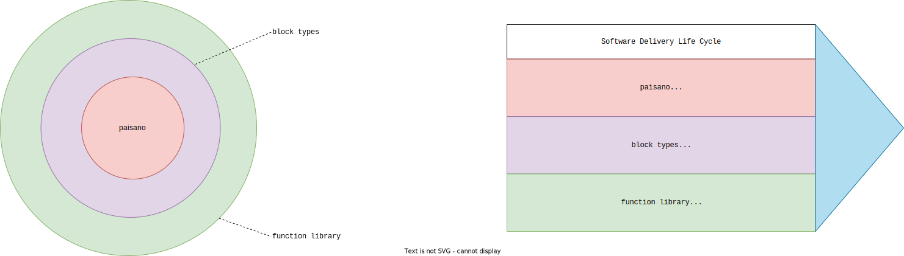

# Standard Design and Architecture

At the time of writing, almost a year of exploratory and freestyle project history has past.
Fortunately, it is not necessary for further understanding, so I'll spare you that.
This document, though, lays out the design, architecture and direction of Standard.

If the topics discussed herein are dear to you, please take it as an invitation to get involved.

This design document can only be altered through an RFC process.

## Overview

Standard is a _framework_ to bootstrap and sustain the automatable sections of the Software Delivery Lifecycle (SDLC) _efficiently_ with the power of Nix and Flakes.
In particular, Standard is a _Horizontal Integration Framework_ which integrates _vertical_ tooling.

> Glossary:
>
> _Vertical Tooling_ does one thing and does it well in a narrow scope (i.e "vertical").
>
> _Horizontal Tooling_ stiches vertical tooling together to a polished whole.

In that context, the integration target are the end-to-end automatable sections of the SDLC process for which we offer well-integrated tools and best practices.
_Efficient_ SDLCs are characterized by two things.

Firstly, by adequate _lead time_ which is the amount of time it takes to set up an initial version of the software delivery pipeline.
It needs to be _adequate_ rather than _just fast_, as it takes place in the context of a team and thus encompasses learning and onboarding activities.
Rather than for speed, they need optimization for success.

Secondly, by short _cycle times_ which is the amount of time it takes for a commit to be shipped to a production environment.
Along this journey, we encounter our scope (more on it below):

- aspects of the _contribution_ environment;
- the packaging pipeline that produces artifacts;
- and continous processes integrating the application lifecycle.

The goal of Standard is to optimize the critical path along this journey to achieve superior _cycle times_ through the powers of Nix and Flakes over frameworks in failure mode of disregard for the intrinsic value of _reproducability_.

## Scope

The automatable sections of the SDLC end-to-end process can be subdivided (not broken up!) in roughly three process regions with different overall shapes and characteristics.

The stipulated process regions are:

- **Contribution Environment** which roughly covers _code-to-commit_.
- **Packaging Pipeline** which roughly covers _commit-to-distribution_. It is typically set up once and then orchestrated by a CI control loop.
- **Continuous 'X' within the Application Lifecycle Management** which roughly covers _distribution-to-next-rollout_.

> Glossary:
>
> We use the term _Contribution Environment_ to mean _Development Environment Plus_.
> Compared to _Development Environment_, it explicitly encapsulates aspects of contribution and integration of the broader process flow.
> If you prefer, you can think _Development Environment_ for practical purposes.

While Standard is fundamentally concerned with optimizing across the end-to-end process, we also limit the scope inside this project repository for practical reasons:

Therefore, we seek to delegate the **Contribution Environment** to a trusted project with an appropriate scope in the broader Nix Community, while employing community outreach to try to ensure our optimization targets are met or at least not accidentally sabotaged.

On the other hand, we seek to delegate **Continuous 'X'** by dovetailing and cultivating outreach with more appropriate initiatives of adjacent ecosystems.

## Ideals

The project is rooted deeply inside the Nix Ecosystem, but it strives to become a portal to make the powers of a store based reproducible packaging system readily available and palatable to colleagues and friends.

- _Use nix only where it is best suited_ &mdash; a Nix maximalist approach may be an innate condition to some of us, but trying to be a portal we deeply recognize and value other perspectives and don't dismiss them as ignorance.
- _Disrupt where disruption is necessary_ &mdash; to our chagrin, the Nix ecosystem is quite a monotheistic silo. Therefore, we don't shy away from deviating from its widely accepted norms and standards when we feel that it furthers our goals.
- _Look left, right, above and beyond_ &mdash; our end-to-end perspective commands us to actively seek and reach out to other projects and ecosystems to compose the best possible value chain.

## Goals

- _Complete_: Standard should make a complete offer for setting up and running the automatbale sections of the SDLC.
- _Optimized_: Standard should optimize for agent ("make your day-to-day life easier") and principle ("quick time-to-market"), alike.
- _Integrated_: Standard should provide the best possible integration experience across a well-curated assortment of verticals.

## Value Matrix

In this section, we'll explain how Standard intents to create value.
We'll make use of a simple value matrix with simple sentiment scores:

- :heart_eyes: &rarr; <i>"absolutely love it!!!"</i>
- :smile: &rarr; <i>"feels pretty good."</i>
- :neutral_face: &rarr; <i>"whatever?!?"</i>

The X-Axis represents the three prototypical stakeholder roles, while the Y-Axis represents the broad value creation categories that we have identified.

|                                                  | Software Sponsor [Principal] | Provider of SDLC Automation [Agent] | Consumer of SDLC Automation [Agent] |
| ------------------------------------------------ | :--------------------------: | :---------------------------------: | :---------------------------------: |
| Productivity                                     |         :heart_eyes:         |            :heart_eyes:             |              :smiley:               |
| Code Organization                                |           :smiley:           |            :heart_eyes:             |              :smiley:               |
| Mental Model & Learning                          |           :smiley:           |            :heart_eyes:             |              :smiley:               |
| Batteries Included                               |        :neutral_face:        |            :heart_eyes:             |           :neutral_face:            |
| Communtiy and Ecosystem                          |        :neutral_face:        |            :heart_eyes:             |              :smiley:               |
| Reproducability & Software Supply Chain Security |         :heart_eyes:         |            :heart_eyes:             |           :neutral_face:            |
| Modularity & Incremental Adoption                |           :smiley:           |              :smiley:               |            :heart_eyes:             |
| Developer Experience & Onboarding Story          |           :smiley:           |              :smiley:               |            :heart_eyes:             |

So, this is for you and your team, if you:

- Care about reproducability
- Value clean code
- Have a deadline to meet
- Want to serve an optimized UX

## Architecture

  <h3>Architecture Diagram</h3>
  

### Code Organization

Standard is build around a balanced model of code organization that promotes transparency, the ability to refactor and productivity.
This code organization is provided by a so-called "Importer Library" housed as an independently useful component under [`divnix/paisano`](https://github.com/divnix/paisano).

It features three principles:

- Three folder levels with predefined semantics
- A single function interface common to all its components
- Typed outputs (which is a novelty compared to Flakes)

The first principle helps you to cut off at a sane level of structure.
Neither too flat, which would make your collection hard to reason about or orderly extend.
Nor too nested, which ends up being an over engineered structure.

The second principle allows for easy organization and refactoring of your global namespace.
From the perspective of one component, all external accessor interfaces are unified, which makes semantic reorganization trivial.
On the flip side, by choosing high level and, above all, stable accessors, productivity may increase.

The third principle allows for keeping code DRY.
There are a finite amount of artifact categories of relevance, such as binary packages or OCI images, among others.
The `paisano` concept of so called Block Types describes these artifact and outputs types in a generic manner and attaches well-known semantics to their handling.

The first two principles combined, also yield collateral benefits when context switching between two standardized projects, by lowering the amount of relearning required as the fundamental organizational principles are stable.
The last principle opens up a realm of possibilities from user interfaces to pipeline automations that we pretend to exploit further down.

### Function Library

Alongside the **Packaging Pipeline**, and by dogfooding its code organization principles, Standard provides a curated assortment of library functions and integrations that users can adopt in accordance with their needs encouraged by the promise of hightened productivity or the peace of mind to build on the shoulders of the entire Standard community.
Some library functions and integrations may be assorted outside of these organizational principles as otherwise unspecial top level shorthands.

### Block Type Library

As mentioned in the context of `paisano` above, Standard exploits the Block Type concept with a focus on providing enriched output types for the SDLC.

For example, it would be redundant in Standard to codify how to build and upload a container image by hand, since the container output type is already fully aware in a highly optimized fashion of these semantics.
As another example, it would be redundant to encode deployment semantics of a terraform deployment declaration, since a (future) terraform type can be made fully aware in a highly optimized fashion (i.e. securely store state) of the required semantics.

### Modularity & Virality Model

Within the scope of the Standard use case, we aim to provide registry-like features to index community provided block types and library functions that are not maintained by the core maintainers.
Such a registry will need to find a good solution for near-code documentation that can be rendered into a compelling index and documentation site.

Strictly, this model may be useful outside of Standard in the context of paisano, but in here that's also not Standard's problem.
