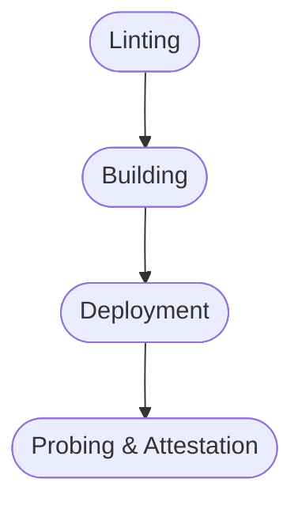

> _Beware: This is an opinionated analysis._
>
> _However, it helps to reason about CI/CD with Standard.
> Standard developed the concept of self-configuring CI through the Standard Registry._

# Overview

Let's look at Continuous Integration (CI) and Continuous Delivery (CD) from a 10000 feet flight height.

For our visual analysis, we use the Business Process Modeling Notation ([BPMN 2.0][bpmn-2]).

For an overview of the notation follow this [link][bpmn-fundamentals].
But don't worry, we'll also walk you through the diagram.

## General Phases

There are four phases that further structure the process.

To automate these, we make use of the [Standard Registry][glossary-registry] that holds all data needed to build the pipeline.
Its is data JSON-serializable so that any CI tool or helper library can auto-generate the pipeline from it.

### Linting Phase

The linting phase ensures that the code base is in good shape.
This can involve verification of formatting, style and auto-generated code.

Typically, these are simple repository tasks that call tools to get the job done.

In the local development environment, you invoke these with your task runner of choice or even configure them in a pre-commit or pre-push hook.

In addition, a Standard-ready CI, runs them first to ensure a short time-to-first-feedback.

### Building Phase

We rely on Nix's declarative build and dependency trees to set up an efficient, intelligently scheduled and reproducible build pipeline.

The Nix cache ensures that no single build is done twice, as long as the build inputs, for example source code or dependencies, do not change.

Since the full dependency tree is known beforehand, intelligent scheduling ensures that shared dependencies are built and cached first before dependent builds are enqueued.

These properties lay on the foundation of reproducible builds.
Thereby, an evaluator predicts expected output hashes ahead-of-time by recursively hashing over all dependencies' own output hashes.
Since that evaluation is cheap when compared to a full build, it is calculated before even starting the first build and is exploited for smart scheduling of the build queue.

An optimized build farm can make particular use of that ahead-of-time evaluation to further optimize overall build times.

The Standard Registry holds all the data in machine readable format that is required by such build farms.

### Deployment Phase

The deployment phase renders service runtime configuration into manifests and pushes them to the API of a platform scheduler, such as Kubernetes.

All reconciliation of the desired application runtime state is then the responsibility of a control loop built or plugged into that scheduler.

#### Push vs Pull Workflows

The industry has diverging opinions about whether a deployment should be pull or push based.

A pull based workflow is initiated by the target infrastructure polling for changes to the manifest source in regular intervals.

The advantages of a pull based workflow include a reduced intrusion surface since any network connection will be strictly outgoing from the target infrastructure.

A push based workflow, on the other hand, starts with CI which triggers deployment based on a particular precondition being met.

Having the target infrastructure listening for incoming connections from the orchestrating CI is also the main disadvantage of the push based workflow, as it increases the intrusion surface.
However, orchestrated workflows, as opposed to the pull-based choreographed ones, are usually easier to reason about and, thus, easier to maintain.

A Standard-ready CI can typically cover simple deployments that follow a trivial render-and-push logic.

For more advanced workflows and roll-out conditions, a suitable state machine is required.

### Probing & Attestation Phase

The probing and attestation phase is highly situation specific.
It cannot be adequately represented through Standard and requires an entirely different control loop.

During this phase a mix of short- & long-lived testing suites are run against a particular target environment, usually called "testing" or "staging".

Some of these suites can be automated in proper test scheduling frameworks, others are inherently manual.

Test suites may include the likes of:

- Penetration Testing
- Property-Based Testing and Fuzzing
- Monkey Testing
- Load and Soak Testing
- End2End Testing
- Benchmarking
- Smoke Testing
- Runtime and Code Auditing

---

In this pattern piece, we didn't cover the release process.
But we'll follow up with a dedicated pattern piece shortly.

[bpmn-2]: https://www.omg.org/spec/BPMN/2.0/
[bpmn-fundamentals]: https://camunda.com/bpmn/reference/
[ci-cd-bpmn]: ci-cd-10000-feet.svg "CI-CD BPMN Model"
[nix-superpower]: ../explain/why-nix.md#nix-superpowers
