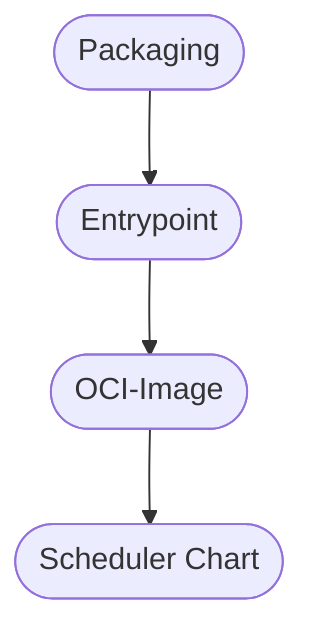

> _This is an opinionated pattern._
>
> _It helps structure working together on microservices with `std`._

# The 4 Layers of Packaging

## The Problem

We have written an application and now we want to package and run it.
For its supply chain security benefits, we have been advised to employ reproducible and source-based distribution mechanisms.
We furthermore need an interoperability platform that is generic and versatile.
Our peers who write another application in another language should share that same approach.
Thereby, we avoid the negative external effects of DevOps silos on integrators and operators, alike.
Short: we make adoption of our application as easy as possible for our consumer.

## The Actors

_Note, that each actor persona can be exercised by one and the same person or a group of persons.
Although possible, and even frequently so, it doesn't imply that these roles are necessarily taken by distinct individuals._

### Developer

The Developer persona incrementally modifies the source code.
At times, such modification are relevant at the interface to the Operator persona.
One such example is when the app configuration is modified.
Another one, when important runtime characteristics are amended.

### Operator

The Operator persona brings the application to production.
She typically engages in further wrapping code or other artifact creation.
She also supervises and observes the running application across different environments.

### Release Manager

The Release Manager persona cuts releases at discrete points in time.
In doing so, she procures their artifacts for general (public) consumtion.
Any release is tied to a sufficiently high level of assurance of an artifact's desired properties.
For that purpose, she works with the Developer, Operator & QA personas along these 4 layers of packaging.

### QA

The QA persona established various levels of assurance of an artifact's desired properties.
Thereby, the observable artifacts can emanate from any layer of these 4 layers of packaging.
She informs the Developer, Operator and Release Manager personas about any found assurance levels.
She can do so through manual or automatic (CI) means.

## The Layers



---

There is one very important factoring & interoperability rule about these layers:

_A domain concern of a higher layer **must not** bleed into previous layers._

Observing this very simple rule, ensures long term interoperability and maintainability of stack. For example, not presuming a particular scheduler in the entrypoint gives contributors a chance to easily add another scheduler target without painful refactoring.

> _**Future Work:** depending on how you count, there may be actually a 5th layer: the **operator** layer. But we may cover this in a future version of this article in further detail. If you don't want to wait, you may have a conceptual look at the [Charmed Operator Framework][charmed-operator] and [Charmehub][charmhub]._

### Packaging Layer

```yaml
Organelle: (clades.installables "packages")
Location:  **/packages.nix          # or **/packages/
Actors:
 - Build Expert Panel, Nix- & language-specific
 - Release Manager
```

This Organelle builds, unittests & packages the application via the appropriate [Nix primitives][nix-superpowers].
Each programming language has a different best practice approach to packaging.
Therfore, a fair ammount of domain knowledge between Nix and the language's build system is required.

The location of the actual build instructions are secondary.
Still, for transparency's and uniformity's sake, they are proxied via this Organelle.
So in the case that upstream already contains appropriate build instructions, the following indirection is perfectly valid (and necessary):

```nix
{ inputs, cell }: {
  app = inputs.upstream.packages.some-app;
}
```

Build instructions themselves should encompass executing unit tests.
Builds that fail unit tests should already be filtered out at this layer (i.e. "a build that fails unit tests is no build, at all").

A release manager may decide to provide these artifacts to the general public on tagged releases.

### Entrypoint Layer

```yaml
Organelle: (clades.runnables "entrypoints")
Location:  **/entrypoints.nix       # or **/entrypoints/
Actors:
 - Developer
 - Operator
```

This Organelle exclusively defines the runtime environment of the application via the entrypoint script. The role
of this script &mdash; customarily written in bash &mdash; serves as a concise and reified communication channel
between Developers and Operators. As such, Operators will find all the primariy configuration flags re-encoded
at a glance and in a well-known location. On the flip side, Developers will find all the magic ad-hoc warpping
that Operators had to engage in, in order to run the application on the target scheduler.

Through this communication channel, operators take reliably note of configuration drift, while Developers gain
a valuable source of backlog to increase the operational robustness of the application.

Standard includes a [specific library function][entrypoint-lib] that establishes an implementation-site interface
which significantly eases working on the following layers.

### OCI-Image Layer

```yaml
Organelle: (clades.containers "oci-images")
Location:  **/oci-images.nix        # or **/oci-images/
Actors:
 - Operator
 - Release Manager
```

Despite the fact that this layered packaging pattern promotes source-based distribution in principle, in common
operating scenarios, we require a stop-gap separation which ensures very fundamentally that nothing is
accidentially _built_ on the target (production) worker node, where it would cannibalize critical resources.

We chose OCI-Images as the binary distribution format that not only provides us with that stop-gap, but
also collaterally procures interoperability for 3rd parties, who use this de-facto industry standard as
their primary deployment artifact.

If the entrypoints have been created via the above mentioned [library function][entrypoint-lib], the creation
of OCI images trivially reduces to:

```nix
{ inputs, cell }: {
  image-hard = cell.entrypoints.app.mkOCI "docker.io/my-image-hardened";
  image = cell.entrypoints.app.mkDebugOCI "docker.io/my-image";
}
```

Alternatively, any of the avaible Nix-based OCI generation mini-frameworks can be used; [`nlewo/nix2container`][n2c]
being one of the more complete and recommended ones. Hence, this mini-framework is also the one that is internally
used by the entrypoints library function.

A release manager may decide to provide these artifacts to the general public on tagged releases.

### Scheduler Chart Layer

```yaml
Organelle: (clades.functions "<sched>Charts")
Location:  **/<sched>Charts.nix     # or **/<sched>Charts/
Actors:
 - Operator
 - Release Manager
```

The scheduler chart is not _yet_ scheduling mainfest data.
Rather, it is a function interface that commonly renders to such json-serializable manifest data.
These mainfests are then ingested and interpreted by the scheduler.

A fair amount of scheduler domain knowledge and familiarity with its scheduling options is required, especially
during creation.

These charts can then be processed further downstream (e.g. in Nix code) to create the final manifests and environments.

Since these charts are the basis of various environments for development, staging and production, it is _highly_ recommended to keep their function interface extremely mininmal **and** stable.
This avoids the risk of inadvertely modifying production manifests (e.g. via a human error in the base charts)
based on a development or staging requirement.
In these cases, it is _highly_ recommended to resort to data-oriented overlay mechanisms for ad-hoc modification.
Those modifications should only propagate into a chart interface after _stabilizing_ and after having successfully percolated through all existing environments first.

A release manager may decide to provide these artifacts to the general public on tagged releases, for example
in the transpiled form of a widely used scheduler-specific config sharing format, such as helm-charts.

> _**Future Work:** it might be a feasible task to extract a common base interface among different schedulers
> and thereby implement a base charts that we could simply specialize for each target schedulers. But this may
> be subject of future research. Potentially the Charmed Operator Framework even obsoletes that need a priori
> and in practical terms._

[charmed-operator]: https://juju.is/docs/olm
[charmhub]: https://charmhub.io/
[nix-superpowers]: ../explain/why-nix.md#nix-superpowers
[entrypoint-lib]: /reference/std/lib/writeShellEntrypoint.md
[n2c]: https://github.com/nlewo/nix2container
[helm-charts]: https://helm.sh/docs/topics/charts/
