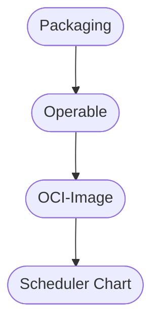

> _Beware: This is an opinionated pattern._
>
> _However, it helps to structure collaboration on micro-services with Standard._

# The 4 Layers of Packaging

## The Problem

We have coded our application and now we want to package and run it.

So, let's just dockerfile the application, dockercompose it into a running thing and celebrate with pizza and beer.

But not so fast!

The statistics about supply chain attacks are alarming. Here are some references:

- Argon, an Aqua Security company, has found that software supply chain attacks grew by [over 300% in 2021][argon-src].
- [Gartner predicts][gartner-src] that by 2025, 45% of organizations would have experienced a software supply chain attack.
- The [FBI has reported][fbi-src] a 62% increase in ransomware attacks from 2020 to 2021.
- A [Cloudbees survey][cloudbees-src] showed that 45% of enterprises have admitted that they’ve secured only half of their software supply chain.

[argon-src]: https://www.helpnetsecurity.com/2022/01/20/software-supply-chain-attacks-2021/
[gartner-src]: https://apiiro.com/blog/gartner-continues-the-push-for-software-supply-chain-security/
[fbi-src]: https://fortune.com/2021/09/03/fbi-warns-of-ransomware-attacks-labor-day-2021/#:~:text=As%20of%20July%2031%2C%20the,same%20time%20frame%20in%202020.
[cloudbees-src]: https://www.darkreading.com/application-security/6-eye-opening-statistics-about-software-supply-chain-security?slide=3

So is the party over, before it even started?

Aggregating articles from [Microsoft][microsoft-src] and [ArsTechnica][ars-technica-src], we can find three broad doors of entry for supply chain attacks:

- Compromised build tools or update infrastructure
- Compromised dependencies through well (i.e. source) or cache (i.e. binary) poisoning
- Compromised identity signing a malicious app to bypass certificate-backed provenance checks

[microsoft-src]: https://learn.microsoft.com/en-us/microsoft-365/security/intelligence/supply-chain-malware?view=o365-worldwide#types-of-supply-chain-attacks
[ars-technica-src]: https://arstechnica.com/gadgets/2021/03/more-top-tier-companies-targeted-by-new-type-of-potentially-serious-attack/

In this pattern piece, we employ a 20 year old, unique approach to packaging to shut close some of these doors of entry.
This battle-tested approach denies a supply chain attacker their ability to compromise build tools and update infrastructure or to poison a cache.
Alongside, we explore ways how teams can structure their collaboration on packaging a micro-service architecture with that technology.

## The Team

### Operator

The operator brings the application to production.

Production is a place, where she cannot allow an attacker to gain access to.

Therefore,

- she clears and protects the perimeter via "perimeter security" tactics,
- she secures transport via "zero trust",
- she encrypts secrets at rest and in flight,
- but, what if the very artifact that is being deployed is a trojan horse?

Many times, we've turned our eyes away from that big luring security hole because we thought it was practically impossible to mitigate it across a decently large software bill of material.

But, since 20 years, we actually can!

In order to prevent an attacker entering in such a way, the operator has to secure her supply chain in close collaboration with our other participant.

### Developer

The developer incrementally modifies the source code.

From time to time, these modifications need to be shipped to that production place.

Locally, on the developer machine, everything looks good and also the CI doesn't complain.

So, off we go!

However, there are a couple of guarantees that she struggles to give with confidence, such as:

- Have you verified all base images and analyzed them for their potential attack surface?
- Can you guarantee stable base images that will never change, once verified?
- Have you properly validated all upstream binary-distributed blobs yourself?
- Can you guarantee that all dependencies, system & language level, are verified and stable?

## The Layers

The Standard layers of packaging are designed to bring both participants together around a framework that holds software supply chain security dear and attackers out.

By providing a shared mental model for flexible, yet structured collaboration, it successfully circumnavigates some of the pitfalls of the underlying technology.

### Packaging Layer

This layer builds the pristine executable application as written by the developer with the building tools of the developer.

However, to ensure the software supply chain requirements, these build instructions are run in the context of a very restricted build environment provided by Nix.

Nix has a vast ecosystem, which makes embedding these build instructions for most languages straight forward.

For many languages, the Nix ecosystem has already developped and vested golden packaging paths.

That means, that in most cases, we simply can put those ecosystem libraries to work.

### Operable Layer

More often than not, born in the heat of chasing features, some aspects of the binary are not quite to liking and necessity of the operator.

We need a buffer zone to accommodate for that, yet with a clear perspective to backlog and polish it off later.

The operable layer is that buffer zone. It is a typically scripted wrapper around the binary which instruments the application for operation.

It is written in a language that both, developer and operator, are comfortable with.

The only viable perspective for this operable wrapper is to become as thin as possible.

Should unmet operational scenarios fatten it up, our participants would schedule a backlog grooming session to address the issue.
In order to put that wrapper on diet, they would refactor missing capabilities from the operable into the binary.

### OCI-Image Layer

But we wouldn't send a script over the wire to our production place, right?!?

Right. To distribute our artifacts, we adopt the OCI Container Specification.

In simple terms, it's a docker image, but that would be misleading terminology.
And to mislead you here for the sake of convenience, doesn't fit our reinvigorated software supply chain mindset.

The OCI Distribution Specification, ensures that distribution, for all intents and purposes of the runtime, is an atomic transaction.

This is convenient, because there is little possibility to end up with a partial and corrupt, but technically executable target state.

It is also convenient, because it is the current de-facto industry standard.

This industry, however, presently discusses its well-understood toil on startup times.
Such is the common practice, that very frequently a non-trivial amount of stale artifacts are shipped.
Through time spent on transport, decompression, extraction and layer re-assembly, they contribute to a noticeable runtime setup latency.

Nix ensures, that only the bare minimum runtime dependencies are included in every OCI image.
Optionally, static builds can be turned on to further dramatically reduce the effective size of the container archive.

And last but not least, recent initiatives at the intersection of both ecosystems strive to further develop cross-pollination of concepts and ideas.

For example, in the Nix ecosystem, massive dependency reuse through global build trees for 50k+ packages is the norm.
This technique is also a promising approach to increase the effectiveness of the OCI layer deduplication by significant margin.

### Scheduler Chart Layer

The final runtime configuration is data.

The scheduler chart layer provides example data that also satisfies the requirements of operational readiness.

This data may be amended according to the concrete operational scenario before being rendered and submitted to the scheduler for reconciliation.

This pattern piece does not proffer any particular tooling to do so.

Any configuration wrangler that has good support for functions and overrides is probably fair game.

One may use Nix, however, as the glue code that provides a globally homologous interface on the command line.

While Standard offers its TUI to that end, many operators may be also already familiar with the vanilla Nix CLI tooling.
